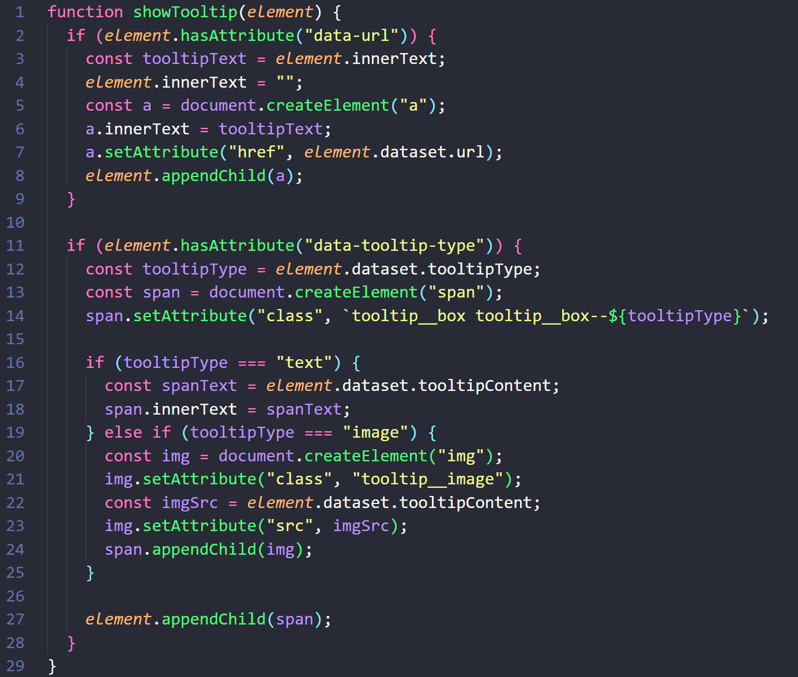
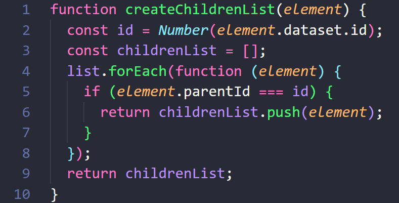
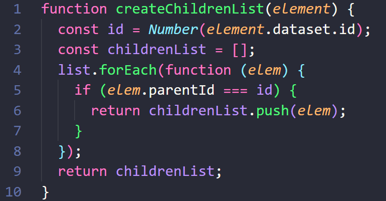

# Tooltips and Content List with Javascript

The project is the conclusion of **5th chapter** (there's **20**) of [devmentor.pl](https://devmentor.pl/mentoring-javascript) mentoring program which focuses on Javascript.

This time I had to create tooltips for words wrapped with `` and create a content list.

---
## Content:

#### [1) Challenges:](#1-challenges)

[1. Function decomposition](#function-decomposition)
[2. Function parameters with the same name](#function-parameters-with-the-same-name)

#### [2) Gained knowledge](#gained-knowledge)

---
### Function decomposition:

One thing that I needed to improve in my project was function's clarity. Although my functions worked correctly they were unnecessary complex:

I had to decompose it so It will be easier to read and comprehend. Instead of one big function I created some smaller ones:

Here we have the main function which is responsible for calling two other functions:

.png)

`createAnchor()` creates anchor, obviously

.png)

`createTooltip` calls another functions which are responsible for creation of different type of tooltips: img and text:

.png)

I don't even need to read a function to comprehend what it's supossed to do. That's why function decomposition is important.

---
### Function parameters with the same name

Know how to name things properly can help avoid unecessary bugs. In this example, it's easy to make mistakes due to the parameters sharing the same name, which may appear to accept the same argument:

Does `element` in `list.forEach(function (element){...});` is the `element` from the `list` or `createChildrenList(element)`? Of course `list` but I don't even want to ask that question. I want my code to be as clean as possible and as easy to understand. Here's small but sufficient improvement:

Now it's obvious that `element` isn't `elem`.

---
### Gained Knowledge:

:white_check_mark: Function decomposition. 
:white_check_mark: Generating HTML elements dynamically based on attributes from existing HTML elements. 
:white_check_mark: Access data from array of objects. 
:white_check_mark: Create an HTML structure using JavaScript, ready for insertion into the DOM.